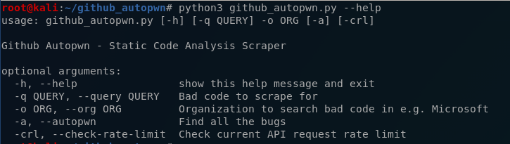

# github_autopwn
Github Scraper For Static Code Analysis

## Usage:

# To-do
- (maybe) add function to open an issue with author if a bug is found
- Build regex to find code-snippets in detected files
- Explore searchcode.com
- Build optional auth to search globally/add to rate-limit
